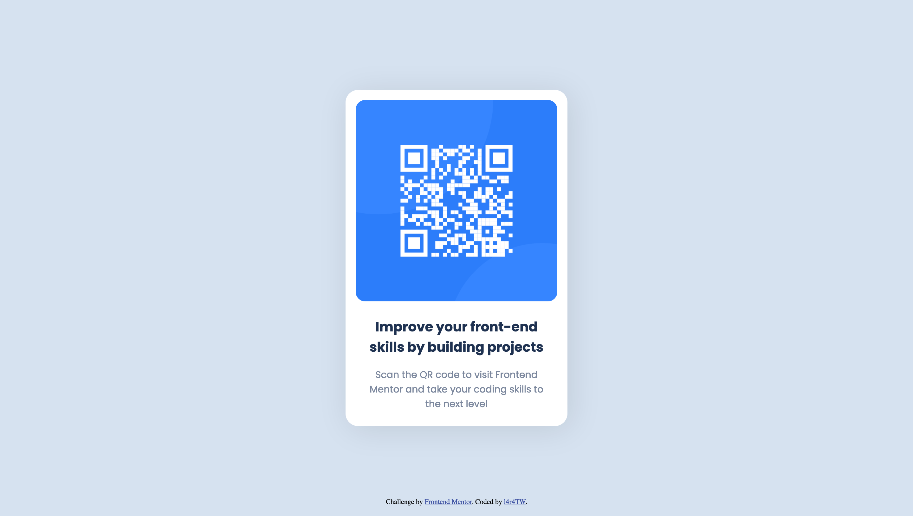

# Frontend Mentor - QR code component solution

This is a solution to the [QR code component challenge on Frontend Mentor](https://www.frontendmentor.io/challenges/qr-code-component-iux_sIO_H). Frontend Mentor challenges help you improve your coding skills by building realistic projects. 

## Table of contents

- [Overview](#overview)
  - [Screenshot](#screenshot)
  - [Links](#links)
- [My process](#my-process)
  - [Built with](#built-with)
  - [What I learned](#what-i-learned)
  - [Continued development](#continued-development)
  - [Useful resources](#useful-resources)
- [Author](#author)

## Overview

### Screenshot



### Links

- Live Site URL: [QRCode card element](https://l4r4tw.github.io/QRCode-html-element/)

## My process

### Built with

- HTML5
- CSS3
- Flexbox
- Mobile-first workflow

### What I learned

I understood the basics of Flexbox. This project also helped me see how widely used HTML and CSS cards are created.

Here is an example of the flexbox I used:

```css
#card{
    display: flex; /* use flexbox */
    justify-content: center; /* center horizontally */
    align-items: center; /* center vertically */
    flex-direction: column;
    max-width: 350px;
    border-radius: 20px;
    padding: 1rem;
    background-color: #fff;
    box-shadow: 5px 5px 50px rgba(0, 0, 0, 0.1);
}
```

### Continued development

The usage of different CSS units (% ,rem, em, vw, etc.) can be a bit overwhelming, so I want to improve my understanding of this topic. I will also practice responsive design.

### Useful resources

- [How To Create Animated CSS Cards](https://www.youtube.com/watch?v=h2x4YTI6WeE) - This video helped me to understand the basics of HTML and CSS cards.
- [rajkmlcodes's solution](https://github.com/rajkmlcodes/qr-code-scan-card) - @rajkmlcodes made a beautiful solution to this project, and he gave me inspiration at the beginning
- [ChatGPT](https://chat.openai.com/chat) - If i struggle with a problem, ChatGPT always helps me to start finding the solution

## Author

- Frontend Mentor - [@L4r4TW](https://www.frontendmentor.io/profile/L4r4TW)
- Twitter - [@l4r4TW](https://www.twitter.com/l4r4TW)
